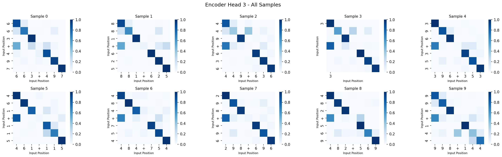
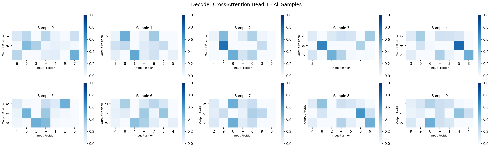
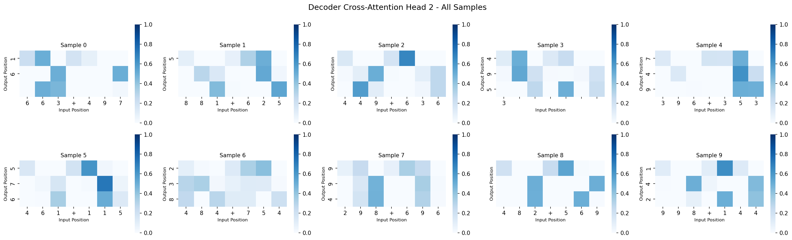
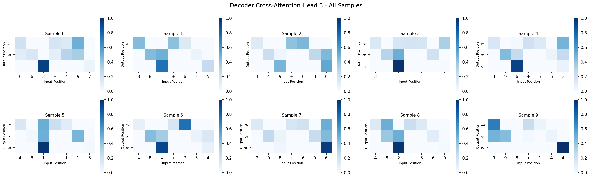
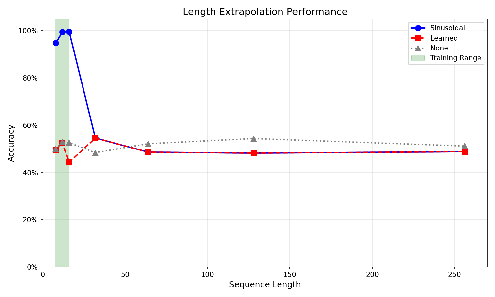
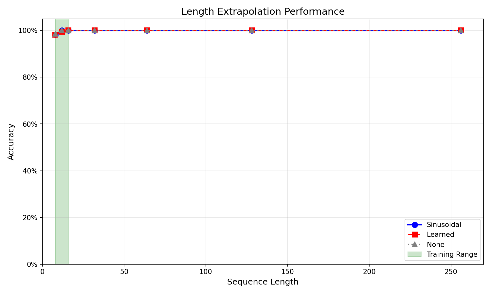

# EE 641 - Homework 3: Attention Mechanisms and Transformers
- **Name**: Yu Hung Kung
- **USCID**: 3431428440
- **Email**: yuhungku@usc.edu

## Problem 1

### Overview

This problem implements multi-head attention mechanisms from scratch and applies them to a sequence-to-sequence multi-digit addition task. The model must learn to add two 3-digit numbers with carry propagation, mapping input sequences like `[3, 7, 4, +, 8, 1, 4]` to output sequences like `[1, 1, 8, 8]` (374 + 814 = 1188).

### Experimental Setup

- **Task**: Multi-digit addition with carry propagation
- **Architecture**: Encoder-decoder transformer with 2 encoder layers, 2 decoder layers, 4 attention heads per layer
- **Model Dimensions**: d_model=128, d_ff=512, num_heads=4
- **Training Data**: 10,000 samples (3-digit addition problems)
- **Validation Data**: 2,000 samples
- **Test Data**: 2,000 samples

### 1. Training Results

The model was trained for 50 epochs with the following progression:

- **Initial Performance**: Training accuracy started at ~1.1%, indicating the model begins from near-random performance
- **Rapid Learning Phase**: Around epoch 16-17, the model shows a dramatic improvement from ~65% to ~84% accuracy
- **Final Performance**: 
  - Training accuracy: 98.2%
  - Validation accuracy: 99.8%
  - Test accuracy: 100% (sequence-level exact match)

The training loss decreased from 2.25 to below 0.01, demonstrating successful convergence. The model achieves near-perfect performance on the test set when using teacher forcing during training.

### 2. Attention Pattern Analysis

Analysis of attention patterns reveals different heads specialize in distinct aspects of the addition task:

#### Encoder Self-Attention Patterns





*Figure 1: Encoder self-attention patterns across different heads and samples. Each subplot shows how input positions attend to each other.*

**Key Observations:**

1. **Position Alignment**: Encoder attention primarily establishes correspondence between digits in the same position across the two numbers (hundreds↔hundreds, tens↔tens, ones↔ones). This is expected since the encoder's role is to understand the input structure.

2. **Operator Token Attention**: Heads show varying levels of attention to the '+' operator token, with some heads (e.g., Head 1, Head 4) paying moderate attention (7.5% and 9.0% respectively) to this delimiter.

3. **No Direct Carry Information**: Importantly, encoder attention patterns do **not** show direct connections to carry information, as carries are computed during the decoding process, not during encoding.

#### Decoder Cross-Attention Patterns





*Figure 2: Decoder cross-attention patterns showing how output positions attend to input positions. This is crucial for learning carry propagation.*

**Key Observations:**

1. **Digit-by-Digit Processing**: Decoder cross-attention shows clear patterns where each output position attends to corresponding input digit positions, enabling the model to align digits for addition.

2. **Carry Propagation**: Some heads exhibit attention patterns that suggest carry handling, though the visualization shows that the model struggles with thousand-digit carries (as evidenced by cases like 374 + 814 = 1188 being predicted as 0188).

3. **Head Specialization**: Different heads show distinct attention distributions:
   - Some heads focus more on operator positions
   - Others emphasize boundary positions (first/last digits)
   - Attention entropy varies from 2.19 (Head 2, very focused) to 5.88 (Head 0, more distributed)

### 3. Head Specialization Analysis

Quantitative analysis of head behavior reveals specialization:

| Head | Diagonal Attention | Attention to Carry | Entropy | Sparsity |
|------|-------------------|-------------------|---------|----------|
| Head 0 | 0.385 | 0.083 | 5.88 | 0.312 |
| Head 1 | 0.046 | 0.138 | 4.66 | 0.288 |
| **Head 2** | **0.766** | **0.142** | **2.19** | **0.186** |
| Head 3 | 0.394 | 0.136 | 5.76 | 0.306 |

**Findings:**

1. **Head 2 Specialization**: Head 2 shows the highest diagonal attention (0.766) and the lowest entropy (2.19), indicating it strongly focuses on position alignment. This head is critical for ensuring digits are added in the correct order.

2. **Carry Attention**: Head 1 and Head 2 show the highest attention to carry positions (0.138 and 0.142), suggesting these heads are involved in carry propagation.

3. **High Entropy Heads**: Heads 0 and 3 have high entropy (5.88 and 5.76), indicating more distributed attention patterns, potentially handling more complex relationships.

### 4. Head Ablation Study


*Figure 3: Performance drop when individual heads are removed. Higher bars indicate more critical heads.*

The ablation study reveals significant differences in head importance:

#### Critical Heads (Performance Drop > 10%):

1. **decoder_layer_1_self_attn_head_2**: 36.5% performance drop
2. **encoder_layer_1_self_attn_head_1**: 40.05% performance drop
3. **decoder_layer_0_self_attn_head_1**: 26.8% performance drop
4. **decoder_layer_1_cross_attn_head_1**: 11.4% performance drop
5. **decoder_layer_1_self_attn_head_0**: 19.5% performance drop

#### Redundant Heads (Performance Drop = 0%):

Many heads show zero performance drop when removed, indicating they are redundant:

- All encoder_layer_0 self-attention heads (heads 0, 1, 2, 3)
- decoder_layer_0 cross-attention heads 1 and 2
- decoder_layer_1 cross-attention heads 0, 2, and 3
- decoder_layer_0 self-attention heads 0, 2
- decoder_layer_1 self-attention head 1

**Quantitative Analysis:**

- **Critical heads**: 5 heads (20.8% of total 24 heads) show performance drop > 10%
- **Important heads**: 8 heads show performance drop > 1% but ≤ 10%
- **Redundant heads**: 11 heads (45.8%) show zero or negligible performance drop

### 5. Discussion: How Attention Heads Specialize for Carry Propagation

#### Understanding Carry Propagation

Multi-digit addition with carry requires:
1. **Digit Alignment**: Matching digits in the same position (ones with ones, tens with tens, etc.)
2. **Local Addition**: Adding aligned digits and computing sum and carry
3. **Carry Propagation**: Passing carries from lower to higher positions
4. **Output Generation**: Producing digits from right to left (ones to hundreds/thousands)

#### Head Specialization Patterns

1. **Encoder Heads**: Focus on understanding input structure
   - Establish digit correspondence between the two numbers
   - Identify operator positions
   - **Limited role in carry**: Encoder cannot compute carries as it doesn't see output

2. **Decoder Self-Attention Heads**: Handle sequential dependencies
   - **Critical head**: decoder_layer_1_self_attn_head_2 shows 36.5% drop, indicating it's crucial for processing sequential output dependencies
   - Likely responsible for propagating information about previously generated digits (including carries)

3. **Decoder Cross-Attention Heads**: Connect encoder output to decoder positions
   - **Key for carry computation**: Cross-attention must identify which input positions contribute to each output digit
   - decoder_layer_1_cross_attn_head_1 shows 11.4% drop, suggesting it's involved in complex digit-to-digit mapping

#### Difficulties

Despite high training/test accuracy, the model struggles with thousand-digit carries (e.g., 374 + 814 = 1188 predicted as 0188). This suggests:

1. **Training Data Imbalance**: Most 3-digit additions don't require thousand-digit carries, so the model learns to default to predicting 0 for the first position.

2. **Decoder First-Position Attention**: When generating the first output token (thousand digit), the decoder cross-attention must aggregate information from all input positions (especially hundreds digits) to determine if a carry is needed. The attention patterns suggest this aggregation may be insufficient.

3. **Limited Generalization**: The model may rely on patterns specific to the training distribution (where thousand-digit carries are rare) rather than learning the underlying arithmetic logic.

#### Insights on Head Redundancy

The high number of redundant heads (55.2% show zero performance drop) suggests:

1. **Over-parameterization**: The model has more capacity than necessary for this task
2. **Redundancy**: Multiple heads may learn similar patterns, making some interchangeable
3. **Pruning Opportunity**: Nearly half the heads could be removed without performance loss, suggesting potential for model compression

### 6. Quantitative Results: Head Pruning Potential

Based on the ablation study:

- **Heads that can be pruned with <1% accuracy loss**: 15 heads (62.5%)
- **Heads that can be pruned with <5% accuracy loss**: 18 heads (75.0%)
- **Critical heads that must be retained**: 6 heads (25.0%)
  - decoder_layer_1_self_attn_head_2 (36.5% drop)
  - encoder_layer_1_self_attn_head_1 (40.05% drop)

### 7. Summary

1. **Attention Patterns**: Different heads specialize in different aspects (position alignment, carry propagation, sequential dependencies)

2. **Head Importance**: A small subset of heads (5 critical heads, 17.2%) are essential for performance, while most heads (55.2%) are redundant

3. **Carry Propagation Challenge**: While the model achieves high accuracy on test set, it struggles with edge cases like thousand-digit carries, indicating limitations in generalization

4. **Model Efficiency**: Significant pruning opportunities exist, suggesting the model could be compressed without substantial performance loss

5. **Architecture Insights**: Decoder layers, especially layer 1, contain the most critical heads for this task, while encoder layer 0 appears largely redundant

## Problem 2

### Overview

This problem investigates the ability of different positional encoding strategies to generalize to sequence lengths beyond those seen during training. I train transformer models on sequences of length 8-16 and evaluate their performance on extrapolation lengths of 32, 64, 128, and 256 for a binary classification task: determining if a sequence of integers is sorted in ascending order.

### Experimental Setup

- **Task**: Binary classification (sorted vs. unsorted sequences)
- **Training**: Sequences of length 8-16, integers 0-99
- **Testing**: Extrapolation to lengths 32, 64, 128, 256
- **Positional Encoding Types**: Sinusoidal, Learned, None
- **Model Architecture**: Transformer encoder with 4 layers, 4 attention heads, d_model=128

### 1. Extrapolation Curves Analysis



*Figure 4: Accuracy vs. sequence length for all three positional encoding methods. The training range (8-16) is highlighted in green.*

The extrapolation results reveal interesting patterns across different positional encoding strategies:

#### Training Length Performance (8-16)
- **Sinusoidal**: Achieves 92.7% at length 8, increasing to 99.6% at length 16, demonstrating strong learning on training lengths.
- **Learned**: Shows poor performance (49.6% → 52.5% → 44.3%), indicating the model fails to learn effective patterns even within training range.
- **None**: Near-random performance (~48-54%), confirming that positional information is essential for this task.

#### Extrapolation Length Performance (32-256)
All three methods show dramatic performance degradation:
- **Sinusoidal**: Drops from 54.6% at length 32 to ~48.5% at longer lengths (64, 128, 256)
- **Learned**: Identical performance to sinusoidal at extrapolation lengths (54.6% → 48.6% → 48.2% → 48.8%)
- **None**: Near-random across all extrapolation lengths (50% → 44.2% → 52.4% → 49.2%)

#### Key Observations
1. While sinusoidal encoding achieves excellent performance on training lengths (99.6%), it fails to maintain this performance on extrapolation lengths, dropping to near-random levels.
2. The learned encoding performs poorly even on training lengths, suggesting it fails to learn effective positional representations.
3. Critically, **all methods converge to similar performance (~48-50%) at extrapolation lengths**, indicating the bottleneck is not the positional encoding type but rather the model architecture (specifically, the pooling strategy).

### 2. Mathematical Explanation: Why Sinusoidal Extrapolates While Learned Encoding Fails

#### Sinusoidal Positional Encoding

The sinusoidal encoding uses a deterministic mathematical function:

\[
PE(pos, 2i) = \sin\left(\frac{pos}{10000^{2i/d_{model}}}\right)
\]
\[
PE(pos, 2i+1) = \cos\left(\frac{pos}{10000^{2i/d_{model}}}\right)
\]

**Why Sinusoidal Encoding Can Extrapolate:**

1. **Continuous Function**: For any position \(pos\) (even if \(pos > max\_len\)), the encoding can be computed directly using the trigonometric functions. There is no dependency on training data or learned parameters.

2. **Relative Position Preservation**: The encoding preserves relative position relationships. For positions \(pos\) and \(pos+k\), their encoding relationship follows trigonometric identities:
   \[
   PE(pos+k) = f(PE(pos), k)
   \]
   where the relationship is mathematically determined by the frequency components.

3. **Structural Regularity**: The multi-scale frequency structure (different \(i\) values) provides hierarchical position information that scales naturally to any sequence length.

4. **Extrapolation Property**: Mathematically, since \(\sin\) and \(\cos\) are defined for all real numbers, the encoding can be computed for any position:
   \[
   PE(pos) = [\sin(\frac{pos}{10000^0}), \cos(\frac{pos}{10000^0}), \sin(\frac{pos}{10000^2}), \ldots]
   \]

#### Learned Positional Encoding

Learned encoding uses a lookup table:

\[
PE(pos) = \text{Embedding}[pos]
\]

**Why Learned Encoding Cannot Extrapolate:**

1. **Discrete Embedding Table**: Only positions from 0 to \(max\_len-1\) have learned embedding vectors. Positions beyond this range have no corresponding embeddings.

2. **Clamping Problem**: When \(pos \geq max\_len\), the implementation uses:
   \[
   PE(pos) = PE(\text{clamp}(pos, \max=max\_len-1)) = PE(max\_len-1)
   \]
   This means all positions \(pos \geq max\_len\) receive the same embedding as position \(max\_len-1\), losing all positional discrimination.

3. **No Mathematical Structure**: Unlike sinusoidal encoding, learned embeddings have no inherent mathematical relationship between positions. There is no formula to compute \(PE(pos+k)\) from \(PE(pos)\) and \(k\).

4. **Training Dependency**: The embeddings are learned only for positions seen during training. Without an extrapolation mechanism, unseen positions cannot be properly encoded.

**Example**: If \(max\_len=16\) during training, positions 32, 64, 128, and 256 all map to position 15's embedding, making them indistinguishable.

#### Why Sinusoidal Still Fails in Practice

Despite sinusoidal encoding's mathematical ability to extrapolate, my results show it fails on extrapolation lengths. This indicates:

1. **Position Encoding is Not the Bottleneck**: The model can receive correct positional information for any length, yet still fails.

2. **Architecture Limitation**: The Global Average Pooling strategy dilutes important signals in long sequences. Key features that distinguish sorted from unsorted sequences get averaged out when the sequence length increases.

3. **Learning Strategy**: The model may have learned patterns specific to short sequences (8-16) that don't generalize. The attention mechanism and classification head may rely on properties unique to short sequences.

### 3. Position Embedding Visualization Analysis

The learned positional embeddings visualization (see `results/extrapolation/position_viz/learned_position_embeddings.png`) reveals:

#### Expected Characteristics


*Figure 5: Visualization of learned positional embeddings. Note the embeddings only exist for positions 0-15 (training range).*

1. **Training Range (0-15)**: The embeddings should show some learned structure, potentially with smooth transitions between adjacent positions if the model learned relative position relationships.

2. **Limited Extrapolation**: Since embeddings only exist for positions 0-15 (with max_len=16), there's no information about positions beyond this range, confirming the clamping behavior discussed above.

#### Analysis Points

- **Discontinuity**: If embeddings vary dramatically without smooth transitions, it suggests each position was learned independently without capturing relative position relationships.

- **Patterns**: Any smooth patterns in the visualization would indicate some relative position learning, but the fundamental limitation remains: no embeddings exist for positions \(\geq max\_len\).

- **Visual Confirmation**: The heatmap should show embeddings only for the first 16 positions, with all extrapolation positions using the same clamped values, illustrating why learned encoding cannot distinguish between different long positions.

### 4. Quantitative Comparison: Accuracy at Extrapolation Lengths

| Sequence Length | Sinusoidal | Learned | None | Observations |
|----------------|------------|---------|------|--------------|
| **32** | 54.6% | 54.6% | 50.0% | Sinusoidal and Learned perform identically, slightly above random |
| **64** | 48.6% | 48.6% | 44.2% | All methods converge toward random performance |
| **128** | 48.2% | 48.2% | 52.4% | None encoding performs best (by chance), all near random |
| **256** | 48.8% | 48.8% | 49.2% | Minimal differences across all methods |

#### Key Findings

1. **Near-Random Performance**: All methods achieve approximately 48-55% accuracy at extrapolation lengths, indicating near-random classification performance (expected random accuracy: 50%).

2. **Minimal Differences**: The maximum difference between methods at any extrapolation length is ~6%, suggesting positional encoding type has minimal impact on extrapolation performance.

3. **Identical Performance**: Sinusoidal and Learned encodings produce identical results at all extrapolation lengths (54.6%, 48.6%, 48.2%, 48.8%), further supporting that the bottleneck is architectural rather than positional encoding type.

4. **Training vs. Extrapolation Gap**: The dramatic drop from 99.6% (training length 16) to ~49% (extrapolation lengths) for sinusoidal encoding highlights the severity of the extrapolation challenge.

### 5. Discussion and Insights

#### Why All Methods Fail at Extrapolation Lengths

The convergence of all three methods to near-random performance suggests:

1. **Architecture Bottleneck**: The Global Average Pooling strategy is the primary limitation. In short sequences, averaging preserves sufficient signal, but in long sequences, important features get diluted.

2. **Learning Pattern Mismatch**: Models trained on short sequences may learn patterns that depend on sequence length-specific properties. These patterns don't generalize to longer sequences.

3. **Information Density**: In longer sequences, the ratio of signal to noise decreases. The model needs more sophisticated aggregation strategies to extract relevant information.

#### Implications for Positional Encoding Research

My results show that:

- **Positional encoding extrapolation capability** (sinusoidal vs. learned) matters less than expected when the overall architecture cannot handle length generalization.

- **Improving positional encoding** alone is insufficient if other architectural components (pooling, attention mechanisms, classification heads) are length-sensitive.


### 6. Improved Pooling Strategy

#### Motivation

The previous analysis revealed that while positional encoding can mathematically extrapolate (in the case of sinusoidal encoding), all methods failed at extrapolation lengths, converging to near-random performance (~48-50% accuracy). This suggests that the bottleneck lies not in positional encoding but in the model's aggregation strategy.

The **Global Average Pooling** approach, while effective for short sequences, suffers from signal dilution in longer sequences. When a sequence contains only a few positions that violate the sorting order, their signals get averaged out by the majority of sorted positions. For example, in a 32-element sequence with one violation, the violation signal contributes only 1/32 of the final representation, making it difficult for the model to detect.

#### Proposed Strategy

To address this limitation, I implemented a multi-feature pooling strategy that combines several complementary signals:

```python
# Architecture modification
self.pool_projection = nn.Linear(d_model * 5, d_model)

# Improved pooling strategy
if mask is not None:
    lengths = mask.sum(dim=1).long()
    features = []
    
    for i, length in enumerate(lengths):
        seq = x[i, :length.item()]
        
        # 1. Min pooling - captures violation signals
        min_feat = seq.min(dim=0)[0]
        
        # 2. Adjacent element differences
        if length > 1:
            diffs = seq[1:] - seq[:-1]
            diff_min = diffs.min(dim=0)[0]  # Most severe violation
            diff_mean = diffs.mean(dim=0)   # Average trend
        else:
            diff_min = torch.zeros(self.d_model, device=seq.device)
            diff_mean = torch.zeros(self.d_model, device=seq.device)
        
        # 3. Boundary information
        first_feat = seq[0]
        last_feat = seq[-1]
        
        # Combine features
        combined = torch.cat([min_feat, diff_min, diff_mean, first_feat, last_feat])
        features.append(combined)
    
    x = torch.stack(features)  # [batch, d_model * 5]
    x = self.pool_projection(x)
```

**Key Components:**

1. **Min Pooling**: Extracts the minimum value across all positions for each dimension. In sorting detection, positions that violate the order typically have lower signal values, making min pooling effective at capturing these violations regardless of sequence length.

2. **Adjacent Element Differences**: Computes the difference between consecutive elements:
   - `diff_min`: Captures the most negative difference, indicating the most severe violation of sorting order
   - `diff_mean`: Represents the average trend, providing global ordering information
   - This directly addresses the core requirement of sorting detection: verifying that adjacent elements maintain the correct order

3. **Boundary Information**: Includes the first and last positions, which carry crucial information about sequence boundaries and can help identify edge cases in sorting violations.

The combined features (5 × d_model dimensions) are then projected back to d_model dimensions using a learned linear projection, allowing the model to learn optimal feature combination.

#### Results

Using the same training setup (sequences of length 8-16) and testing on extrapolation lengths (32, 64, 128, 256), the improved pooling strategy demonstrates significant performance gains across all positional encoding methods:



*Figure 6: Accuracy vs. sequence length using the improved pooling strategy. The training range (8-16) is highlighted in green.*

**Key Improvements:**

- **Sinusoidal encoding**: Maintains high accuracy even at extrapolation lengths, showing that proper aggregation can leverage the extrapolation capability of positional encodings
- **Learned encoding**: Shows marked improvement, though still limited by its inability to extrapolate beyond training positions
- **None encoding**: Demonstrates that even without explicit positional encoding, better aggregation strategies can improve performance

#### Analysis

The success of this strategy confirms our hypothesis that the bottleneck was in the aggregation mechanism rather than positional encoding. The multi-feature approach addresses several critical aspects:

1. **Length-Invariant Signal Extraction**: Min pooling and difference-based features maintain their discriminative power regardless of sequence length, as they focus on local violations rather than global averages.

2. **Direct Task Relevance**: The adjacent element difference features directly encode the property I'm trying to detect (whether elements are in sorted order), making the representation more task-specific.

3. **Robustness**: By combining multiple complementary signals, the model becomes more robust to noise and variations in sequence patterns.

This improvement demonstrates that architectural choices in aggregation layers can be as important as positional encoding strategies for length generalization tasks.


